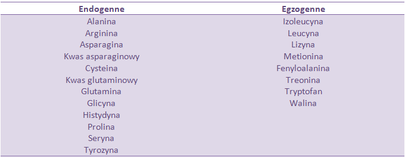
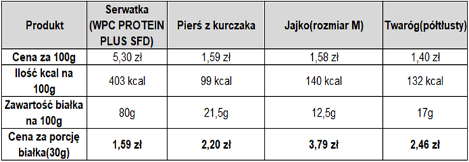

Białko jest bez wątpienia bardzo ważnym makroskładnikiem w diecie każdego sportowca. Jest budulcem niemal każdej tkanki. Odpowiedzialne jest za powstawanie nowych tkanek oraz rozwój i regeneracje już istniejących. W tym artykule poruszymy najważniejsze kwestie związane z białkiem oraz omówimy najlepsze, naszym zdaniem, źródła białka.

&nbsp;

### **Do czego potrzebne jest nam białko?**

Jak już wspomnieliśmy na początku, białko odpowiada za regenerację tkanek oraz ich rozwój. Białko jest ważnym czynnikiem w procesie syntezy białek mięśniowych. Polega on na wymianie białek, które uległy zniszczeniu podczas treningu, na białka nowe, które są mocniejsze od poprzednich. (Trening stymuluje proces transkrypcji i translacji, zwiększając biosyntezę białek). W efekcie otrzymujemy hipertrofię (przerost), czyli powiększenie włókien mięśniowych, a dokładnie komórek. Dlatego w rezultacie nie rośnie nam natomiast ilość tych włókien. Takie zjawisko nazywamy hiperplazją(rozrost) i może się pojawić po wielu letnich treningach w niewielkim stopniu. Procesem przeciwnym do syntezy białek, jest ich rozpad czyli proteoliza, która prowadzi do rozkładu białek na aminokwasy i peptydy. Hormonem odpowiadającym za hamowanie rozpadu białek jest insulina.

[Badania](https://www.ncbi.nlm.nih.gov/pubmed/18577697) wskazują, że wzrost jej stężenia we krwi  pomaga zahamować proces rozpadu białek.

&nbsp;

### **Z czego zbudowane są białka?**

Białka zbudowane są z aminokwasów(wpis odnośnie aminokwasów znajdziecie [tutaj](https://zachlorowani.pl/bcaa-brakujacy-element/)) czyli organicznych związków chemicznych, które powstają w układzie trawiennym poprzez trawienie białek. Są cegiełkami budującymi ludzki organizm. Istnieje dwadzieścia aminokwasów, które mogą łączyć się ze sobą na wiele różnych sposobów. Aminokwasy dzielą się na: endogenne oraz egzogenne (niezbędne). Aminokwasy endogenne to te, które organizm potrafi wytworzyć samodzielnie, a egzogenne z kolei muszą zostać dostarczone z pożywienia ponieważ organizm nie jest w stanie ich wytworzyć.

&nbsp;

&nbsp;

Warto również wspomnieć o metabolizmie białek. Polega on na rozpadzie białek na aminokwasy do tzw. puli aminokwasowej, która znajduje się w tkankach ciała i krwi. Następnie mogą powędrować jedną z czterech dróg:

• budowa nowych białek,  
• utlenienie, 
• przekształcenie w glukozę w procesie glukoneogenezy, 
• przetworzenie w tkankę tłuszczową

&nbsp;

### **Jakie źródło białka wybrać?**

Jednym z najbardziej popularnych źródeł białka wśród sportowców z pewnością jest serwatka. Wynika to z faktu, że jest bardzo ława i szybka w przygotowaniu.  
Kolejnym popularnym produktem, który posiada sporą ilość białka jest kurczak, a dokładniej mówiąc pierś z kurczaka. Składa się prawie z samego białka, przy minimalnym udziale tłuszczów. Nie jest on już niestety tak szybki w przygotowaniu jak szejk, o ile nie będziemy jeść surowego, czego nie warto próbować. Następnym często wybieranym źródłem protein są jajka. Zawierają one wiele witamin m.in. A, E, D,K, a także witaminy z grupy B oraz minerały takie jak fosfor, żelazo, magnez, cynk, potas, sód, wapń, miedź i selen.

&nbsp;

Przy omawianiu tematu białka, warto również zwrócić uwagę na nabiał. Nie mówimy tutaj o słodkich jogurtach, które zawierają dużą ilość cukru i raczej śladowe ilości białka. Jeżeli chodzi o produkty nabiałowe, najlepiej wypada twaróg. Zawiera on znaczną ilość białka przy niewielkim udziale węglowodanów i tłuszczy (o ile wybierzemy wersję chudą lub półtłustą). Trzeba również wspomnieć, że są osoby, które mogą cierpieć na nietolerancję laktozy. W ich przypadku organizm ma problemy z odpowiednim rozkładem laktozy. Za rozkład laktozy na cukry proste odpowiada enzym zwany laktazą. W przypadku osób z nietolerancją laktozy istnieje niedobór laktazy albo całkowity jego brak(alaktazja). W twarogu półtłustym  znajduje się ok. 3g laktozy, natomiast najwięcej w mleku – ok. 4,5g.

&nbsp;

Omawiane tutaj źródła białka są najpopularniejsze i warto oprzeć na nich swoją dietę. W tabeli poniżej znajdują się informacje odnośnie ceny oraz zawartości białka w opisywanych przed chwilą produktach.

&nbsp;

&nbsp;

### **Nie dajmy się zwariować**

Nie potrzebujemy białka serwatkowego czyli odżywki białkowej ze sklepu z suplementami, aby zaspokoić dzienne zapotrzebowanie na ten makroskładnik.  Okienko (tzw. okno anaboliczne) po treningu nam się nie zamknie i nic się nie stanie jeśli zamiast wypić odżywkę, zjemy posiłek (jak już lepiej wypić carbo czy vitargo).  **Nie jest też prawdą, że większa ilość białka powoduje większe przyrosty.**  
Różnica pomiędzy 1,4 g białka na kg masy ciała, a 2,4 g na kg masy ciała była prawie nie zauważalna, ale [publikacja](https://www.researchgate.net/profile/Stuart_Phillips/publication/21681796_Evaluation_of_protein_requirements_for_trained_strength_athletes/links/00b7d538de66771ce7000000.pdf) również wykazała, że w przypadku zwiększonej dawki (2,4g) organizm nie wykorzystuje więcej leucyny do hipertrofii.

&nbsp;

### **Ile białka powinniśmy spożywać?**

Jest to pytanie z którym można spotkać się bardzo często. Wiele osób ma problemy z odpowiednim doborem ilości tego makroskładniku.

Zapotrzebowanie na białko zależne jest od tego jaki jest nasz cel.  
Związku z tym u zwykłych ludzi są to zalecania w okolicach **0,9 g na kg. masy ciała**. W przypadku osób, których celem jest redukcja masy ciała zaleca się spożywanie [2.3g białka na kilogram masy ciała](https://journals.lww.com/acsm-msse/Fulltext/2010/02000/Increased_Protein_Intake_Reduces_Lean_Body_Mass.14.aspx). W przypadku budowania masy mięśniowej organizm potrzebuje [białka na poziomie 1.2g](https://www.researchgate.net/publication/21681796_Evaluation_of_protein_requirements_for_trained_strength_athletes) na kilogram masy ciała.  
Starsze osoby mogą odnosić korzyści przy zwiększonej podaży białka około **1,0-1,2 g/kg mc.** (ma to na celu przede wszystkim pomóc z utratą masy i siły mięśniowej związana z wiekiem). Osoby uprawiające sporty o treningach o umiarkowanej intensywności treningu powinni dostarczać **1,2-1,5 g** białka na kg masy ciała na dobę. Natomiast w przypadku treningach o dużej intensywności podaż powinna być na poziomie **1,5 g-2,0 g/kg mc.** Nowe badanie również sugerują, że podaż białka w okolicach **3g /kg mc.** może mieć wpływ na pozytywny na skład ciała u osób trenujących siłowo, przy utracie tkanki tłuszczowej.

**My podpowiadmy, że dawki w okolicach 1,8 g powinny być wystarczające dla naszych mięśni. Innymi słowy, aby nasilić syntezę białek oraz zapobiegac katabolizmowi.**

&nbsp;

### Rekompozycja

W trakcie rekompozycji zalecane jest spożycie **białka na poziomie od 2 g do 2,2 g/kg.mc.**

&nbsp;

### **Białko zwierzęce czy roślinne?**

Zacznijmy od tego, że nie powinniśmy się sugerować popularnym zwrotem „pełnowartościowe białko”. [Badanie](https://nutritionj.biomedcentral.com/track/pdf/10.1186/1475-2891-12-86) wykazało, że białko z ryżu może dawać takie same, a w niektórych przypadkach nawet lepsze efekty od serwatki.

&nbsp;

### **Białko, a nerki**

W przypadku osób zdrowych przekroczenie zalecanej ilości spożycia białka, niewątpliwie nie będzie miało poważnych konsekwencji. Jednak sytuacja wygląda inaczej u osób, które mają problem z nerkami. Wyższe spożycie białka może uszkadzać nerki oraz wątrobę, ale uwaga na czynność nerek jest uzasadnione u osób, u których niewydolność tego narządu może się rozwinąć z uwagi na cukrzyce, nadciśnienie tętnicze i na zwyrodnienie wielotorbielowate nerek.  
Badania, które są dostępne i obejmujące maksymalnie rok obserwacji, w których oceniano wpływ spożywania białka w ilości 2,5–3,3 g/kg mc./dobę u zdrowych osób trenujących , nie wykazały szkodliwego wpływu dużej podaży białka na stężenie tłuszczy we krwi oraz funkcjonowania wątroby i nerek.

&nbsp;

### Białko roślinne, a zwierzęce

Przy zwierzęcych źródłach białka nadmiar może spowodować, że nasze jelita będą „zapchane” resztkami tego mięsa. A jak wiemy w jelitach trawione są węglowodany.  
Dlatego warto zrównoważyć swoją dietę i skorzystać z białka roślinnego jak i zwierzęcego. Mówi się, że nadmiar białka może zakwaszać organizm, nie jest do końca pewne czy dieta ma wpływ na zakwaszenie organizmu, natomiast wiadome jest, że białko wrażliwe jest na temperaturę i niskie ph.
