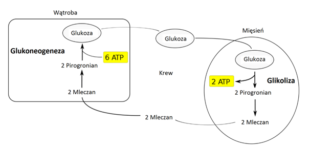

Chyba każdy kto kiedykolwiek trenował jakiś sport poczuł nie raz, najczęściej na następny dzień, ból mięśni po treningu. Na pewno zastanawiałeś lub zastanawiałaś się, jak radzić sobie z „zakwasami”? Na początku wyjaśnijmy sobie czym są te nasze słynne „zakwasy” i co nas tak naprawdę boli.

&nbsp;

### **Czym są „zakwasy”?**

To nic innego jak _delayed onset muscle soreness_, a tłumacząc to na język polski - zespół opóźnionego bólu mięśniowego. Błędne nazewnictwo wzięło się stąd, że kiedyś myślano, że to kwas mlekowy powoduje owe obolałości zostając w mięśniach. Tak naprawdę kwas mlekowy, który jest produkowany podczas wysiłku beztlenowego, przy rozpadzie glukozy (Cykl Corich/zdj. 1) zostaje usunięty z organizmu po 1-2 godzinach, a dokładniej jest zamieniany z powrotem na glukozę w wątrobie.

źródło: https://pl.wikipedia.org/wiki/Cykl\_Corich

&nbsp;

### **Skąd bierze się ból związany z DOM-sami?**

Wracając do DOMS-ów to ból z nimi związany powstaje poprzez uszkodzenia włókien mięśniowych, a dokładniej komórek mięśniowych i ich obrzęk z wyciekiem cytoplazmy. Do uszkodzeń dochodzi w trakcie treningu. Przyczyną bólu może być również stan zapalny który towarzyszy temu procesowi. Jedną z możliwości zbadania obciążeń treningowych czyli sprawdzenia ilości uszkodzeń mięśniowych, jest badanie kinazy kreatynowej z krwi(CK). Wykonana przed, w trakcie oraz po mikro cyklu pomoże w doborze obciążeń, a także poinformuje o „ilości” właśnie uszkodzeń włókien mięśniowych. Do największych uszkodzeń dochodzi podczas treningu siłowego(ale nie tylko), który jest niezastąpiony również w treningu pływaka. Ważnym aspektem jest to, że do większych uszkodzeń mięśni dochodzi przy fazie ekscentrycznej(rozluźnianie mięśni) niż fazie koncentrycznej (kurczenie mięśnia). Istnieje specjalny rodzaj treningu który powoduje maksymalne uszkodzenia włókien mięśniowych, o którym napiszę innym razem.

&nbsp;

### **Jak niwelować DOMS-y?**

Ważne jest zwiększenie dostępu krwi do danych partii, czyli lekka rozgrzewka, masaż, sauna i stosowanie na zmianę zimnego i ciepłego prysznicu. Podobne efekty daje również kąpiel w soli (EPSOM), wystarczy już około 500 g soli i 15-20 minut kąpieli  3 razy w tygodniu (możliwe, że zaraz jakiś pływak wpadnie na pomysł dosypania soli do basenu, ja jeszcze nie próbowałem, możecie być pierwsi). Ważne jest również, aby dostarczyć odpowiednich składników odżywczych, które pomogą odbudować uszkodzone włókna jak najszybciej. Pamiętajcie, że większy ból dzień po treningu nie oznacza, że był to lepszy trening.
