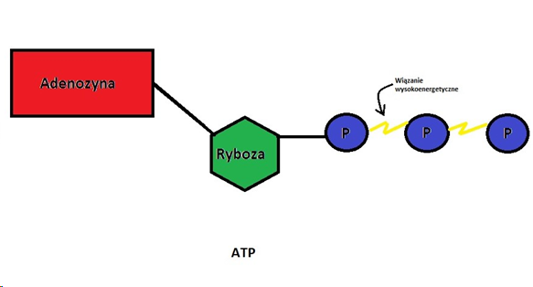
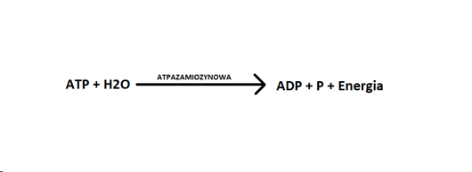
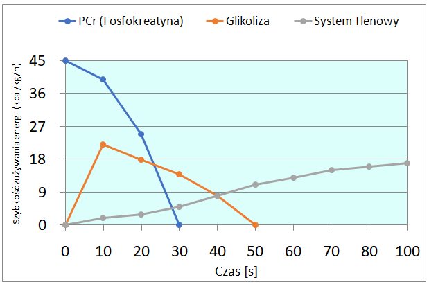
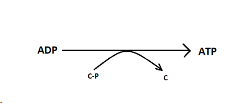
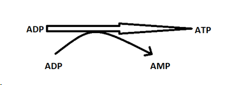
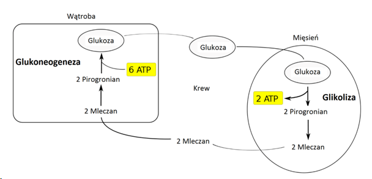
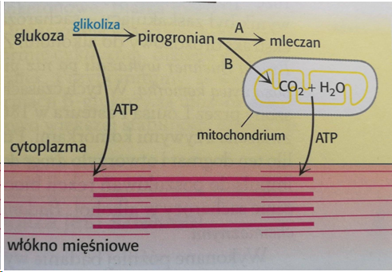

Nasz organizm istnieje dzięki energii pozyskiwanej z ATP. Jest to związek organiczny - adenozynotrifosforan (Adenozyno-5′-trifosforan). Związek ten jest zbudowany z jednej cząsteczki adenozyny i trzech reszt fosforanowych.

&nbsp;

&nbsp;

### **Do czego potrzebne jest nam ATP?**

Ogólnie rzecz biorąc do istnienia. Brak tego związku chemicznego doprowadziłby do śmierci. Sportowcom potrzebne jest jednak do czegoś innego. Do energii w sporcie, czyli wykonania skurczu mięśnia. Ważne jest, że podczas pracy mięśni zmniejsza się ilość ATP, a zapotrzebowanie na nie rośnie. Więc niestety z samego ATP zgromadzonego w mięśniach, energii wystarczyłoby tylko na kilka sekund (1-2s) pracy. Np. Skurczu mięśnia. Ilość ATP magazynowanego w mięśniach zależy od włókien mięśniowych (o których szczegółowo opowiemy sobie przy okazji oddzielnego artykułu). Istnieją trzy rodzaje włókien mięśniowych:

• wolnokurczliwe - typ I,  
• pośrednie - typ IIA  
• szybkokurczliwe - typ IIX

&nbsp;

Każdy z nas posiada około 25 mmol ATP/na kg suchej masy lub ok. 8 mmol ATP/kg mokrej masy \[J.Górski 2019\].

&nbsp;

ATP podczas uwalniania energii rozpada się na ADP i wtedy uwalniana zostaje energia.

&nbsp;

&nbsp;

W czasie godzinnego pływania zużywa się do około 60 kg ATP. To pokazuje jak ważny jest to system. Dlatego organizm potrzebuje niemal ciągłej jego produkcji i robi to dzięki procesom resyntezy.  
Istnieją cztery systemy pozyskiwania tego związku chemicznego. Trzy beztlenowe (szybkie) i jeden tlenowy (wolny). Nigdy nie jest tak, że działa tylko jeden system resyntezy. Zawsze jeden jest dominujący, zależy to od czasu trwania wysiłku i jego intensywności. Występuje tzw. kontinuum energetyczne, które pokazane jest na wykresie poniżej.

&nbsp;

&nbsp;

Trzy systemy resyntezy zachodzą beztlenowo, czyli bez udziału tlenu. Ostatni system wykorzystuje tlen. Prawdopodobnie zostały wytworzone zanim na naszej planecie była wystarczająca ilość tlenu.

&nbsp;

### **Beztlenowe systemy resyntezy ATP**

**Kinaza kreatynowa** czy też fosfokreatyna w którym oba substraty dostarczamy z jedzeniem. Dzięki kreatynie, która dostarcza jedną cząsteczkę fosforanu do ADP, tworzy nam się znowu ATP. \[Czas wysiłku na tym systemie od 5 do 7 sekund, zależy też od poziomu wytrenowania\].

Tutaj suplementacja kreatyny będzie odgrywać największą role. Właśnie dzięki temu systemowi resyntezy i dostarczaniem z pożywienia kreatyny C i fosforanu P. Zwiększa nam się siła i moc w pierwszych sekundach wysiłku poprzez wydłużenie pracy pierwszego systemu.  
W drugiej części artykułu dowiecie się jak suplementować kreatynę, dlaczego ciężko jest ją uzupełnić z jedzenia i czemu nie suplementujemy fosforanu.

**Miokinaza** inaczej kinaza adenylowa, która wykorzystuje ADP i poprzez zabranie jednej cząsteczki fosforu, rozkładając go do AMP(adezynomonofosforan) pozyskujemy dzięki temu cząsteczkę fosforanu do zbudowania ATP. \[Czas pracy do 1-2 sekundy\].

Glikolityczny czy też **glikoliza beztlenowa** - energia przekształcana jest z cukrów, a dokładniej z glukozy. Glukoza pozyskiwana jest z glikogenu (glikogenoliza; mięśnie i wątroba) oraz z krwi wolną glukozę. Efektem ubocznym tego procesu jest wydzielanie się kwasu mlekowego (LA), który jest również przyczyną przerwania wykonywania wysiłku w intensywności IVA. \[Z tego systemu możemy czerpać energię od 30 sekund do 2 minut\].  
Z jednej cząsteczki glukozy, pozyskujemy dwie cząsteczki ATP.  
Rysunek pokazuje proces glikolizy oraz glukoneogenezy czyli metabolizm kwasu mlekowego z powrotem w glukozę. W jednej komórce nie mogą zachodzić dwa procesy jednocześnie. System ten dominuje w pływaniu na dystansie 100-200 metrów.

&nbsp;

&nbsp;

### **Tlenowe systemy resyntezy ATP**

**System mitochondrialny**, oksydacyjny, glikoliza tlenowa. Do produkcji w tym systemie wykorzystywane są mitochondria, które wykorzystują tlen. Substratem jest tlen, cukry i tłuszcze. Jest to system z którego czerpiemy ATP przy długim wysiłku fizycznym. Dzięki temu systemowi można wykonywać wysiłek fizyczny do bariery którą stanowi nasza psychika. Z glikolizy tlenowej pozyskujemy 8 ATP, a w późniejszym cyklu Krebsa 30 ATP. Do wysiłków typowo tlenowych zaliczamy pływanie na dystansie 1500 metrów i więcej.

&nbsp;

&nbsp;

1. Małe, stężenie O2 (np.ostatnie sekundy sprintu),
2. Normalne stężenie (długi, powolny bieg; pływanie).

&nbsp;

### **Najważniejsze fakty:**

\-w czasie regeneracji ATPAZA zamienia się z wolnej na szybką,

\-trening nad pierwszym systemem zapewnia moc - dynamikę,

\-w treningu siłowym w celu zwiększenia zapasów ATP potrzebne są długie przerwy,

\-w organizmie mamy trzy razy więcej fosfokreatyny (C~P) niż ATP,

\-suplementacja kreatyny ma wpływ na pierwszy system resyntezy.

\-praca nad 3 systemem zwiększa wytrzymałość anaerobową, a nad 4 aerobową

&nbsp;

#### Bibliografia:

Jan Górski „Fizjologia wysiłku i treningu fizycznego”.

„Biochemia” Jeremy M. Berg - Lubert Stryer - John L. Tymoczko - Gregory J. Gatto.
