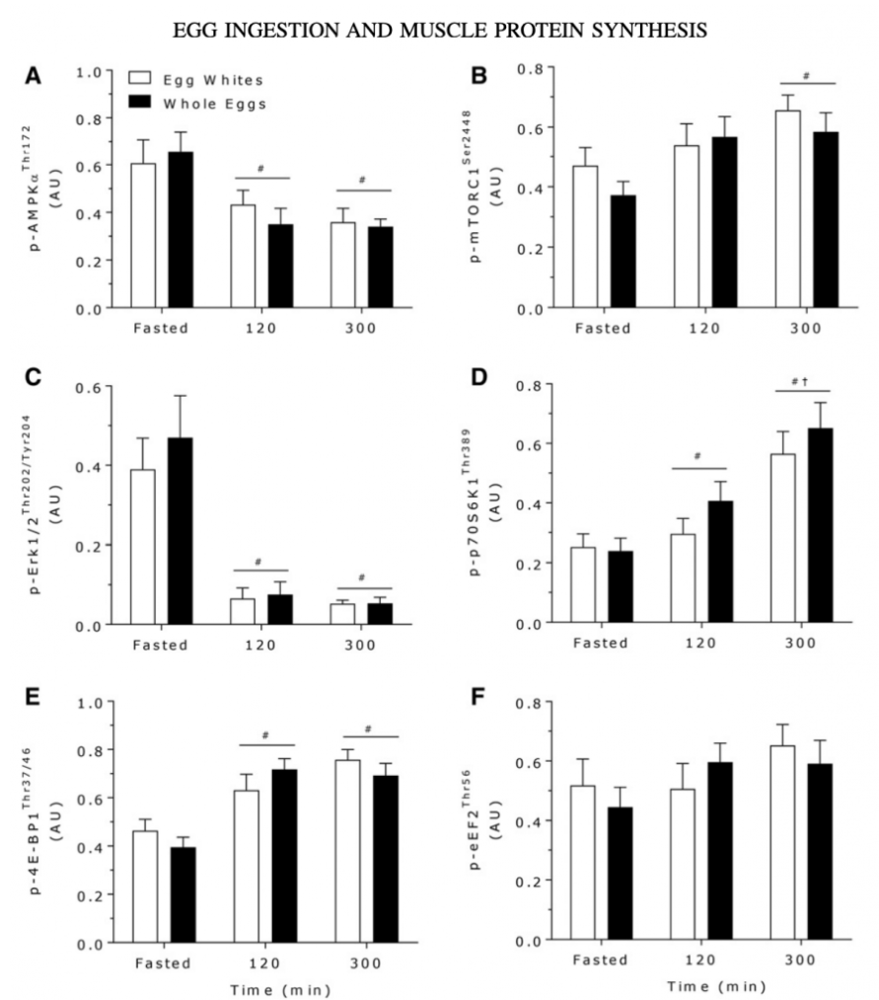

**MPS**, czyli muscle protein synthesis. Z angielskiego synteza, a dokładniej biosynteza białek mięśniowych.

Na początku musimy podkreślić, że jest to bardzo złożona reakcja i do teraz tak naprawdę nie wiadomo jak dokładnie działa.

&nbsp;

[Białko](https://zachlorowani.pl/bialko-w-diecie-sportowca/) jest budulcem mięśni. Jednak w naszym organizmie, jednocześnie następuje budowa (anabolizm) i rozpad (katabolizm) mięśni. Dzieje się tak z powodu dążenia przez nasz organizm do równowagi, czyli homeostazy. Taka nasza natura. System budujący mięśnie to wspomniany MPS, a system rozkładu to Muscle Protein Breakdown. I właśnie stosunek tych dwóch procesów MPS do MPB definiuję czy mięśnie w organizmie są budowane.

Tak jak to już zrobiliśmy podobnie na przykładzie [BCAA](https://zachlorowani.pl/bcaa-brakujacy-element/), aby zobrazować sobie ten procesy musimy wyobrazić sobie dom z cegieł, który cały czas budujemy. 
&nbsp;

Z jednej strony dostarczamy nowych cegieł, aby mieć grubsze i większe ściany, tym czasem z drugiej strony domu ktoś nam kradnie te cegły. Jedynym sposobem, aby postawić dom w tym przypadku jest nasilenie dostawy nowych cegieł (MPS), niż ten ktoś (MPB) zdołałby nam ukraść. Dlatego, aby mięśnie w naszym ciele się rozrastały należy stymulować MPS, aby przeważał nad rozpadem białek.

&nbsp;

## Hipertrofia 

Synteza protein jest nierozłącznym procesem potrzebnym do hipertrofii (rozbudowy domu). Wzmacnia i powiększa włókna mięśniowe, wcześniej odpowiednio stymulowane.  Ponadto, jest potrzebna w budowie jak i regeneracji organizmu, gdyż proces ten zachodzi w każdym narządzie naszego ciała.

&nbsp;

## Kiedy zachodzi proces syntezy protein?

Trzeba spełnić kilka warunków, aby można było mówić o syntezie. Między innymi stymulacja następuje, poprzez trening siłowy/oporowy oraz odpowiednią podaż białka w diecie oraz dostarczenie energii z pożywienia (tzn. nie możemy być na deficycie kalorycznym, ale możemy być na „zerze kalorycznym”).

Skąd brać białko oraz jakie źródła opisaliśmy [tutaj](https://zachlorowani.pl/bialko-w-diecie-sportowca/), teraz skupimy się na dawkach potrzebnych do wywołania MPS.

&nbsp;

## Badania

Według ISSN zawartość leucyny w każdym posiłku sportowca powinna wynosić 0,7-3 g, czyli około 20-40 g pełnowartościowego białka.

Aby zoptymalizować syntezę protein i osiągnąć maksimum potrzebujemy około 20 g białka w każdym posiłku. Zaleca się, aby tę dawkę stosować w trakcie dni treningowych, a nie treningowych około 40g białka w posiłki. Badania sugerują również dawki w wysokości 0.4g na kg. masy ciała na posiłek. Wpływ kondycji naszego ciała oraz jego skład nie ma wpływu na proces syntezy protein. Pamiętajmy, że oprócz odpowiedniej podaży białka, musimy również dostarczać energie czyli kilokalorie z pożywienia.

&nbsp;

[Badanie](https://doi.org/10.3945/ajcn.112.055517) z University of Birmingham, które sprawdzało odpowiedź na MPS u mężczyzn, którym podano 10, 20, lub 40 gramów białka serwatki bezpośrednio po treningu oporowym, zaowocowało takimi wynikami:

• 10-gramowa dawka białka serwatki nie miała wpływu na MPS.  
• 20-gramowa dawka zwiększyła MPS o 49 procent.  
• 40-gramowa dawka zwiększyła MPS o 56 procent, ale także spowodowała nadmierne gromadzenie się mocznika (co jest naturalnym efektem wymiany azotowej, jest to również marker obciążenia organizmu treningiem siłowym czy wytrzymałościowym).

&nbsp;

Istnieje również badanie, które pokazało, że dodanie 5 gramów BCAA do 6,25 gramów białka serwatkowego zwiększyło MPS identycznie jak przyjmowanie 25 gramów samego białka serwatkowego. Odpowiedzialna była za to leucyna.

&nbsp;

## Próg leucynowy 

Próg leucynowy szacuje się na poziomie około 2 g leucuny na posiłek. Jest on odpowiedzialny za nadanie sygnału do wzrostu syntezy protein. Niestety może być często nadinterpretowany. Leucyna może nasilać syntezę białek mięśniowych bez dodatku innych aminokwasów egzogennych.  
O ile brzmi to super, to dostarczanie tylko jednego aminokwasu jest nie na miejscu, ponieważ na przykładzie BCAA udowodniono, że powinno dostarczać się pełny aminogram białek.   
Drugi argumentem trochę przeczącym progowi leucynowemu jest fakt, że badania były przeprowadzane na czczo, a dodając do tego prędkość trawienia białek przez nasz organizm, która nie jest wysoka (a już na pewno zjedzone z tłuszczami i węglowodanami), więc białko uwalniane jest dość wolno i długo. Z tego powodu wydaje się to mało istotne w życiu codziennym.

Czy to źle, że białko trawi się dłużej skonsumowane z tłuszczami i cukrami? Odpowiedz znajdziecie przy okazji tematu poniżej. Przy okazji postawimy kolejne pytanie.

&nbsp;

## To odżywka białkowa czy konwencjonalne jedzenie?  

O ile po dostarczeniu odżywki, rzeczywiście widać szybsze i większe nasilenie procesu syntezy białek, tak jak wspomnieliśmy wyżej zazwyczaj dotyczy to bycia na czczo. To także przy „zwykłych” posiłkach bogatych w białko są plusy i to znaczne. Efektem wolniejszego trawienie jest dłuższy czas trwania syntezy protein. To samo tyczy się kazeiny, czyli wchłania się wolniej a synteza jest niższa, ale trwa dłużej. Można także pomyśleć o mieszankach, które zawierały by białka o różnym tempie trawienia.

&nbsp;

Istnieje bowiem publikacja, w której badano 10 wytrenowanych mężczyzn w wieku około 21 lat, z poziomem tkanki tłuszczowej około 16 %. Jednej grupie podawano całe [jaj](https://zachlorowani.pl/jak-to-jest-z-tymi-jajami/)[k](https://zachlorowani.pl/jak-to-jest-z-tymi-jajami/)[a](https://zachlorowani.pl/jak-to-jest-z-tymi-jajami/) w ujęciu makro składników - 18 g białka i 17 g tłuszczy, a drugiej same białka jaj- 18 g białka. U obu grup zaobserwowano stymulację MPS, jednak u grupy jedzącej całe jaja była ona zauważalnie większa.

&nbsp;

Z wykresów można odczytać zwiększone MPS 0-120 min po konsumpcji:

• białka jaja (ok. 0,098%/h),  
• całe jaja (ok. 0,140%/h).

&nbsp;

Zwiększone MPS 120-300 min po konsumpcji:

• białka jaja (ok. 0,078%/h),  
• całe jaja (ok. 0,123%/h).

&nbsp;

## Czy coś jeszcze wpływa w takim razie na MPS?

Fakt, które sam się nasuwa oraz teoria, która jest tłumaczeniem, dlaczego tak się dzieje dotoczy niebiałkowych stymulatorów procesów syntezy protein. Mogą to być witaminy, składniki mineralne, tłuszcz i inne bioaktywne molekuły między innymi mRNA czy czynniki wzrostu.

&nbsp;

### A co z omegą 3, czyli kwasami EPA i DHA, które są również w [jajku i to właśnie w żółtku?](https://zachlorowani.pl/jak-to-jest-z-tymi-jajami/)

Dostępne są badania, w których suplementacja EPA i DHA spowodowała zwiększenie ich stężenia w fosfolipidach mięśniowych i przyczyniła się do lepszej odpowiedzi anabolicznej podawanych wraz z białkiem. Wyraźna była większa masa mięśniowa również u osób starszych (z wiekiem zwiększa nam się zapotrzebowanie na białko więcej [tutaj](https://zachlorowani.pl/bialko-w-diecie-sportowca/)).

&nbsp;

**Ogólne zalecenia, aby nasilić MPS to:**

• 3-5 posiłków dziennie  
• Od 20 g do 40 g biała w posiłku (najlepiej te z pełnym aminogramem i z dużą zawartością leucyny)  
• dostarczanie białka co 4-5 godzin   
• Dostarczanie energii w kaloriach (nie można być na deficycie, ewentualnie rekompozycja)

&nbsp;

## MPS, a warunki treningu

Najlepszym treningiem nasilającym biosyntezę jest trening siłowy nastawiony na hipertrofię.

Dużo zależy również od podejścia do treningu oraz od stopnia zaawansowania, jednakże - jeśli chcemy, aby mięśnie nam rosły z maksymalną i zależną od danego organizmu prędkością, musimy spełnić kilka warunków:

&nbsp;

• Trenować co najmniej kilka razy w tygodniu każdą partię mięśniową,  
• Ilość powtórzeń w zakresie 8-12 z takim ciężarem, aby mieć 1-2 powtórzenia w zapasie,  
• Progresować w dłużej perspektywie ciężarem,  
• W przypadku hipertrofii bardzo dużą rolę odgrywa objętość treningowa.

&nbsp;

Pamiętajmy że mięśnie regenerują się od 24 do 72 h. W tym czasie następuje największy peak MPS po treningu. Należy to uwzględnić w swoim planie treningowym. Zalecamy trenować duża partię od 2 do 3 razy w tygodniu, a mniejsze od 3 do 4.
